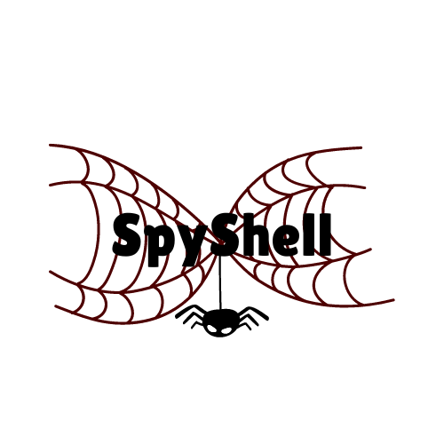

	<h1 style="text-align:center;">SpyShell</h1>
    	
  

  <h2>Commands ;-)</h2>
    <b>#1. stegnoscanner</b> 
    <b>#2. revenger</b> 
    <b>#3. fileinfo</b> 
    <b>#4. grabip</b> 
    <b>#5. ohshit ("subdomain enum")</b>
  

